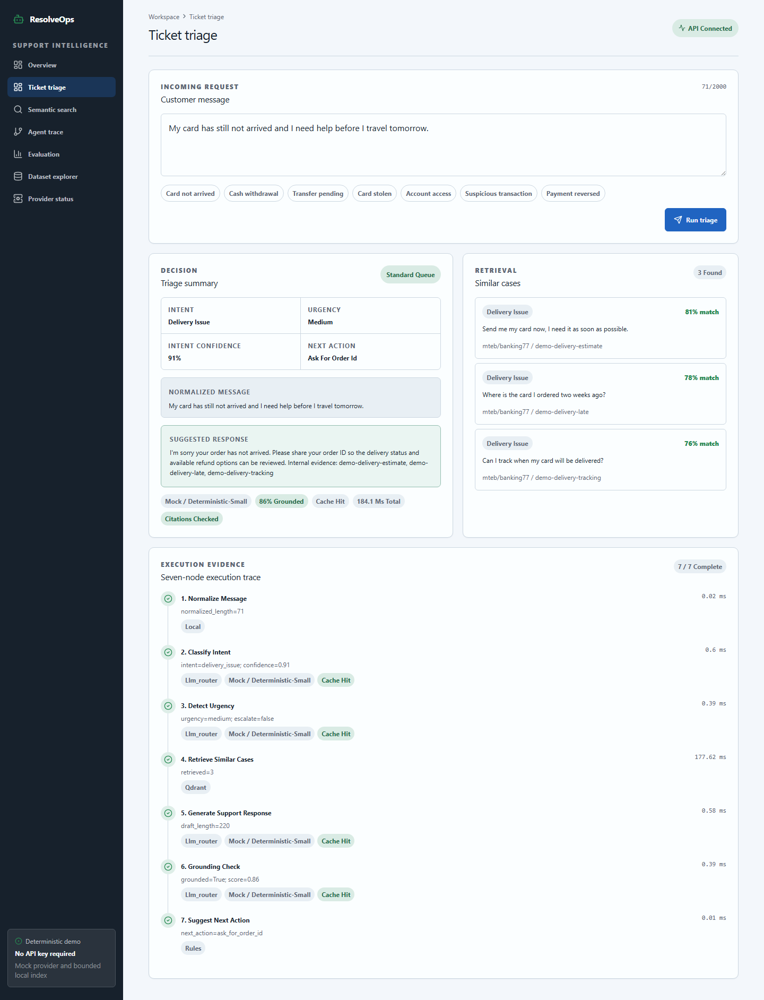
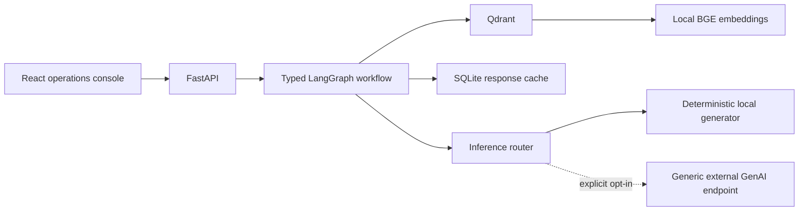
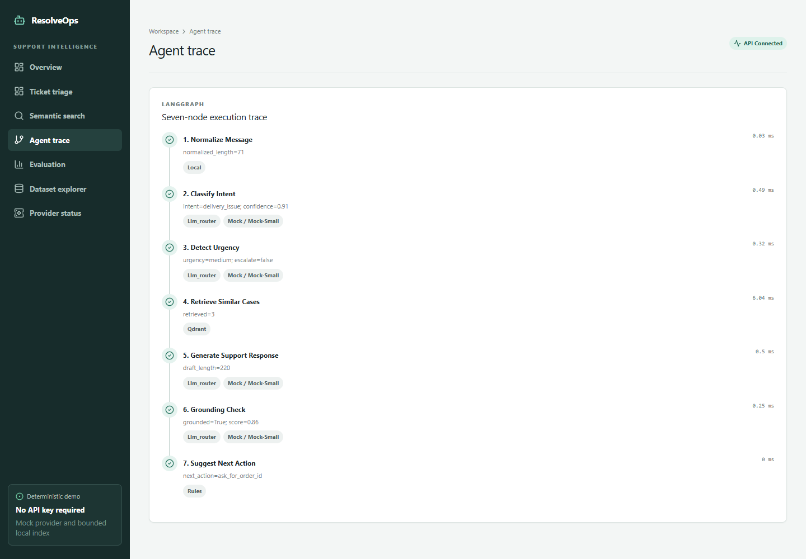

# Customer Support RAG Triage Agent

A typed, inspectable RAG triage workflow that retrieves support evidence, drafts a response, checks grounding, and recommends a human action.

**[Open the live zero-key demo](https://pracill-customer-support-rag-triage-agent.hf.space/)**



## Evidence-backed outcomes

- Runs a fixed seven-node LangGraph workflow with typed state and an inspectable per-node trace.
- Retrieves bounded Banking77-derived evidence from Qdrant with local BGE embeddings and stable, idempotent fixture IDs.
- Exposes inference mode, cache, fallback, degraded-mode, retrieval, grounding, and human-action metadata.
- Ships a zero-key deterministic review path plus a checked-in 8-ticket regression artifact. The fixture demonstrates reproducibility, not real-world model quality.
- Preserves an optional generic external GenAI route without coupling the public repository to a specific inference vendor.

[](https://github.com/Praciller/customer-support-rag-triage-agent/actions/workflows/ci.yml)


## Reviewer path

1. Open the live demo and run **Card not arrived**.
2. Read the decision, retrieved cases, grounding state, and recommended human action.
3. Inspect the complete 7/7 trace and the deterministic evaluation fixture.
4. Review the architecture, evaluation methodology, and security boundaries.

This is a reviewable support decision workflow with an explicit human-review boundary.

## Architecture



The public demo bootstraps 27 bounded Banking77-derived records into Qdrant without duplicating stable IDs. Demo and mock modes are deterministic and require no external model account or credential. A generic server-side external GenAI endpoint remains available as an explicit non-demo route.

## Workflow stages

1. `normalize_message`
2. `classify_intent`
3. `detect_urgency`
4. `retrieve_similar_cases`
5. `generate_support_response`
6. `grounding_check`
7. `suggest_next_action`

Each successful node records duration, bounded input/output summaries, component, inference metadata, cache/fallback/degraded flags, retrieval count, and grounding result. Empty retrieval or degraded generation cannot produce a grounded final result.



## Deterministic evaluation

The checked-in evaluation uses local `BAAI/bge-small-en-v1.5` embeddings, deterministic generation, 27 indexed demo records, and 8 labeled evaluation tickets.

| Metric | Result |
| --- | ---: |
| Intent accuracy / macro F1 | 100.0% / 100.0% |
| Urgency accuracy | 100.0% |
| Precision@5 / Recall@5 | 37.5% / 62.5% |
| MRR / nDCG@5 | 0.771 / 0.611 |
| Zero-result rate | 0.0% |
| Grounding-verifier pass rate | 100.0% |
| Unsupported-claim flag rate | 0.0% |
| Workflow success rate | 100.0% |
| P50 / P95 local latency | 16.2 ms / 28.8 ms |

Recall and nDCG use the three known relevant fixture records per intent. These are deterministic regression results from a deliberately small, rules-aligned fixture. They are not production latency, policy correctness, semantic-entailment, or universal model-quality claims. See the [generated summary](reports/evaluation/summary.md) and [methodology](docs/evaluation.md).

## Local quickstart

```powershell
python -m venv .venv
.venv\Scripts\Activate.ps1
python -m pip install -r requirements.txt
Copy-Item .env.example .env
uvicorn src.api.main:app --reload --port 8000
```

In another terminal:

```powershell
cd frontend
npm ci
npm run dev
```

Open `http://localhost:5173`. The first FastEmbed run downloads the public BGE ONNX model. CI can use hashing embeddings for a network-free workflow check.

### Optional external GenAI route

The default remains local/mock. To activate external GenAI outside demo mode, configure a server-side endpoint that accepts the neutral JSON contract documented in [`docs/model_routing.md`](docs/model_routing.md):

```env
DEMO_MODE=false
MOCK_LLM_MODE=false
EXTERNAL_LLM_URL=https://your-server-side-endpoint.example/v1/generate
EXTERNAL_LLM_API_KEY=
EXTERNAL_LLM_MODEL=general
```

The browser never receives the endpoint credential. If the external route fails, the existing router can fall back to the deterministic local provider and marks fallback/degraded state in workflow metadata.

### Docker alternative

```powershell
docker compose up --build
```

- Console: `http://localhost:5173`
- API docs: `http://localhost:8000/docs`
- Readiness: `http://localhost:8000/ready`
- Qdrant: `http://localhost:6333/dashboard`

## Testing and verification

```powershell
.venv\Scripts\ruff.exe check src tests
.venv\Scripts\ruff.exe format --check src tests
.venv\Scripts\python.exe -m pytest

cd frontend
npm run lint
npm test
npm run build
```

Reproduce the checked-in evaluation from the repository root:

```powershell
$env:DEMO_MODE="true"
$env:MOCK_LLM_MODE="true"
$env:QDRANT_MODE="memory"
$env:EMBEDDING_PROVIDER="fastembed"
$env:LLM_CACHE_ENABLED="false"
.venv\Scripts\python.exe -m src.evaluation.evaluate_triage
```

## API review points

```powershell
curl.exe http://localhost:8000/health
curl.exe http://localhost:8000/ready
curl.exe -X POST http://localhost:8000/triage -H "Content-Type: application/json" -d '{"message":"My card has not arrived","top_k":5}'
curl.exe -X POST http://localhost:8000/search-similar -H "Content-Type: application/json" -d '{"message":"I need a refund","top_k":5}'
curl.exe http://localhost:8000/eval/results
```

`/provider-health` reports whether external inference is configured and active, along with cache, embedding, vector-store, and ingestion state. It never returns credentials or the configured external URL.

## Security and limitations

- Requests forbid extra fields and bound message length, `top_k`, confidence values, and ingestion batch size.
- Public ingestion is disabled; non-local ingestion requires `X-Admin-API-Key`.
- External inference credentials stay server-side and are only used when demo/mock modes are explicitly disabled.
- Controlled errors omit stack traces, environment values, credentials, external endpoint URLs, and local paths.
- Retrieved records are untrusted precedent, not company policy. The grounding check validates evidence presence and workflow behavior, not semantic entailment.
- Draft responses require human review. Prompt injection, policy authority, tenant isolation, distributed rate limiting, and sensitive-data retention require controls beyond this demo.
- The in-memory limiter and local Qdrant/SQLite state are single-process constraints. Free CPU hosts may cold-start or exceed memory limits.

## Documentation

- [Architecture and node contracts](docs/architecture.md)
- [Deterministic demo mode](docs/demo_mode.md)
- [Inference routing](docs/model_routing.md)
- [Data source and license](docs/data_source.md)
- [Evaluation methodology](docs/evaluation.md)
- [Qdrant lifecycle](docs/qdrant.md)
- [Deployment](docs/deployment.md)
- [Security](docs/security.md)
- [Operations runbook](docs/runbook.md)
- [Portfolio review](PORTFOLIO_REVIEW.md)

## Resume bullet

Built a retrieval-grounded support triage workflow with typed LangGraph orchestration, Qdrant and local BGE embeddings, deterministic evaluation, a vendor-neutral optional external GenAI adapter, cache/fallback controls, protected FastAPI endpoints, and a React evidence-and-trace console.
