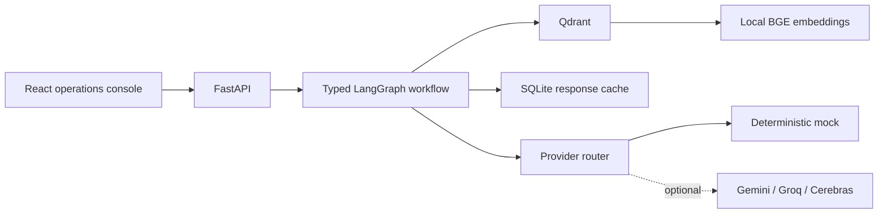
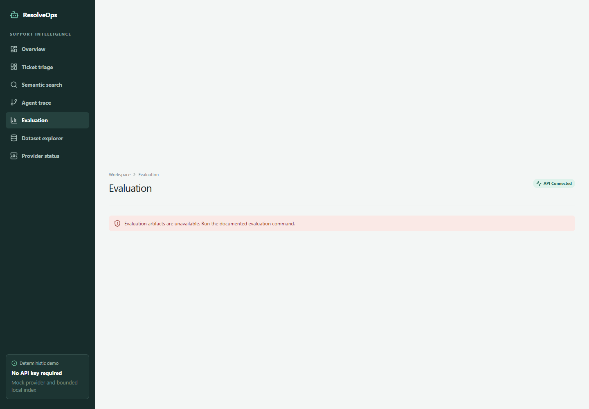

# Customer Support RAG Triage Agent

[](https://github.com/Praciller/customer-support-rag-triage-agent/actions/workflows/ci.yml)


**[Open the live zero-key demo](https://pracill-customer-support-rag-triage-agent.hf.space/)**

A local-first support operations system that classifies incoming tickets, detects urgency,
retrieves related public examples, drafts a grounded response, verifies the draft, recommends a
human action, and exposes every LangGraph node in an inspectable trace. The default demo requires
no API keys and makes no external LLM calls.


## Why this is not a generic chatbot

The application executes a fixed, typed seven-stage workflow. It returns evidence, confidence,
grounding status, provider/cache/fallback metadata, and a human-review action instead of running
an open-ended autonomous conversation.

## 30-second reviewer path

1. Open the [live demo](https://pracill-customer-support-rag-triage-agent.hf.space/) and choose an example ticket.
2. Run triage and inspect the retrieved cases plus all seven trace nodes.
3. Open Evaluation to review the checked-in deterministic artifact.
4. Review [architecture](docs/architecture.md), [evaluation](docs/evaluation.md), and
   [security](docs/security.md).

## Architecture



The public demo bootstraps 27 bounded Banking77-derived records into Qdrant idempotently. Provider
credentials remain backend-only and are optional. See [docs/architecture.md](docs/architecture.md).

## Workflow stages

1. `normalize_message`
2. `classify_intent`
3. `detect_urgency`
4. `retrieve_similar_cases`
5. `generate_support_response`
6. `grounding_check`
7. `suggest_next_action`

Each trace step includes status, duration, bounded input/output summaries, component,
provider/model where applicable, cache/fallback/degraded flags, retrieval count, and grounding
result.


## Measured deterministic evaluation

Generated on June 21, 2026 with local `BAAI/bge-small-en-v1.5` FastEmbed embeddings, the mock
provider, 27 indexed demo records, and 8 labeled evaluation tickets.

| Metric | Result |
| --- | ---: |
| Intent accuracy / macro F1 | 100.0% / 100.0% |
| Urgency accuracy | 100.0% |
| Precision@5 / Recall@5 | 37.5% / 100.0% |
| MRR / nDCG@5 | 0.771 / 0.814 |
| Zero-result rate | 0.0% |
| Grounded response rate | 100.0% |
| Unsupported-claim rate | 0.0% |
| Workflow success rate | 100.0% |
| P50 / P95 latency | 11.0 ms / 40.2 ms |

These are regression results for a small deterministic fixture, not production quality or latency
claims. See [the full artifact](reports/evaluation/summary.md) and
[methodology](docs/evaluation.md).

## Verified public smoke test

On June 21, 2026, the public deterministic mock demo returned 3 retrieval matches, an 86%
grounding result, and a complete 7/7 LangGraph trace for the card-delivery ticket. The final
browser check found no application console errors. This single-ticket smoke result is deployment
evidence; it does not replace the evaluation metrics above.



## Tech stack

- Python 3.12, FastAPI, Pydantic, LangGraph
- Qdrant and local `BAAI/bge-small-en-v1.5` embeddings via FastEmbed
- SQLite cache; optional Gemini, Groq, and Cerebras routing
- React 19, Vite, TypeScript, Tailwind CSS
- Pytest, Vitest, Ruff, ESLint, Docker Compose, GitHub Actions

## Local quick start

```powershell
python -m venv .venv
.venv\Scripts\Activate.ps1
pip install -r requirements.txt
Copy-Item .env.example .env
uvicorn src.api.main:app --reload --port 8000
```

In another terminal:

```powershell
cd frontend
npm ci
npm run dev
```

Open `http://localhost:5173`. The Vite development proxy targets `http://localhost:8000`.

## Docker quick start

```powershell
docker compose up --build
```

No `.env` file is required for the deterministic demo. Services:

- Console: `http://localhost:5173`
- API docs: `http://localhost:8000/docs`
- Readiness: `http://localhost:8000/ready`
- Qdrant: `http://localhost:6333/dashboard`

## Demo mode

The default contract is `DEMO_MODE=true`, `MOCK_LLM_MODE=true`,
`BOOTSTRAP_DEMO_DATA=true`, and `ALLOW_PUBLIC_INGEST=false`. Startup indexes only missing fixture
records, so restarts do not duplicate data. See [docs/demo_mode.md](docs/demo_mode.md).

## Commands

| Command | Purpose |
| --- | --- |
| `make setup` | Install Python dependencies |
| `make lint` | Run Ruff lint and formatting checks |
| `make format` | Apply Ruff fixes and formatting |
| `make test` | Run the backend test suite |
| `make eval` | Run deterministic offline evaluation and write reports |
| `make demo` | Run the offline evaluation demo and print API examples |
| `make api` | Start the local FastAPI service |
| `make clean` | Remove generated local caches, indexes, and build output |

## API examples

```powershell
curl.exe http://localhost:8000/health
curl.exe -X POST http://localhost:8000/triage -H "Content-Type: application/json" -d '{"message":"My card has not arrived","top_k":5}'
curl.exe -X POST http://localhost:8000/answer -H "Content-Type: application/json" -d '{"message":"I need a refund","top_k":5}'
curl.exe -X POST http://localhost:8000/evaluate
curl.exe http://localhost:8000/metrics/sample
```

`/answer` reuses the grounded triage workflow. `/evaluate` and `/metrics/sample` return the latest
offline evaluation artifact; run `make eval` to refresh it without external provider calls.

## Optional real-provider mode

Set `DEMO_MODE=false`, `MOCK_LLM_MODE=false`, configure provider keys only in `.env`, and choose
models through environment variables. Real-provider evaluation is intentionally excluded from CI.
Provider catalogs and free quotas can change; verify configured model IDs before use.

## Data source and license

The bounded fixture derives from [mteb/banking77](https://huggingface.co/datasets/mteb/banking77),
a mirror of PolyAI Banking77. The fixture records CC BY 4.0, upstream/source identifiers,
`demo-fixture-v1`, normalization, intended use, and limitations. Banking77 contains intent-labeled
questions, not real company policy or approved responses. See [docs/data_source.md](docs/data_source.md).

Source code is licensed under [MIT](LICENSE). Banking77-derived data remains under CC BY 4.0;
the dataset license is separate from the source-code license.

## Security

- Request schemas reject extra fields and bound message length, `top_k`, and ingestion batch size.
- `/triage`, `/search-similar`, and `/ingest` use configurable in-memory rate limits.
- Public ingestion is disabled; non-local ingestion requires `X-Admin-API-Key`.
- Provider status never returns keys; API failures return controlled messages without stack traces.
- Generated responses require human review.

See [docs/security.md](docs/security.md).

## Known limitations

- The demo dataset is small and is not authoritative company policy.
- Mock accuracy reflects deterministic rules matched to the fixture, not general model quality.
- The rate limiter and local Qdrant/SQLite state are per-process and unsuitable for horizontal scale.
- Free CPU hosts may cold-start or exceed memory limits while loading the embedding model.
- The public Space is a manually maintained Hugging Face Git repository, not an automatic GitHub
  deployment; source changes require an explicit Space rebuild.

## Documentation

- [Architecture](docs/architecture.md)
- [Demo mode](docs/demo_mode.md)
- [Model routing](docs/model_routing.md)
- [Data source](docs/data_source.md)
- [Evaluation](docs/evaluation.md)
- [Deployment](docs/deployment.md)
- [Security](docs/security.md)
- [Runbook](docs/runbook.md)
- [Portfolio review](PORTFOLIO_REVIEW.md)

## Resume bullet

Built a key-free, retrieval-grounded support triage system using typed LangGraph orchestration,
Qdrant and local BGE embeddings, deterministic offline evaluation, protected FastAPI endpoints,
provider fallback/cache controls, React workflow observability, Docker, and CI.
