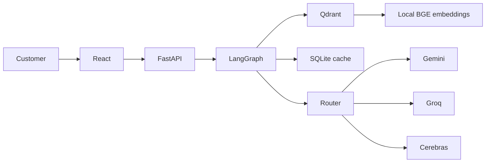
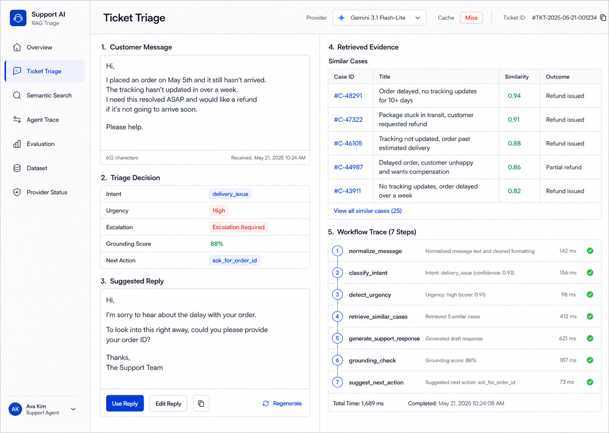

# Customer Support RAG Triage Agent

A support operations assistant that classifies a ticket, detects urgency, retrieves related
public support queries, drafts a response, verifies grounding, and exposes the complete
LangGraph trace.

## Why This Is Not a Generic Chatbot

The product executes a fixed support workflow with typed state, vector retrieval, escalation
logic, cache-first multi-provider routing, grounding checks, and measurable evaluation. It
returns a recommended human action, not an autonomous conversation.

## Dataset Source

[mteb/banking77](https://huggingface.co/datasets/mteb/banking77) is the script-free mirror of
PolyAI Banking77: 13,069 English banking support queries, 77 original intents, CC BY 4.0.
Original labels remain in metadata while the application maps them to nine operational intents.
See [docs/data_source.md](docs/data_source.md).

## Tech Stack

- Python 3.12, FastAPI, Pydantic, LangGraph
- Qdrant and local `BAAI/bge-small-en-v1.5` embeddings via SentenceTransformers or FastEmbed
- Gemini, Groq, Cerebras, SQLite LLM cache
- React 19, Vite 8, TypeScript, Tailwind CSS
- Pytest, Vitest, Ruff, Docker Compose, GitHub Actions

## Architecture



LangGraph runs `normalize_message`, `classify_intent`, `detect_urgency`,
`retrieve_similar_cases`, `generate_support_response`, `grounding_check`, and
`suggest_next_action`. Qdrant applies semantic top-k search with score threshold and optional
intent filtering.

## LLM Routing, Caching, and Fallback

Small models handle classification; Gemini handles generation and verification. Every request
uses a provider/model/task-aware cache key. Providers have bounded retries and priority fallback.
Total failure returns a safe manual-review response with `degraded_mode=true`.
See [docs/model_routing.md](docs/model_routing.md).

## Setup

```powershell
python -m venv .venv
.venv\Scripts\Activate.ps1
pip install -r requirements.txt
Copy-Item .env.example .env
cd frontend
npm install
cd ..
```

Set provider keys only in `.env`. Use `MOCK_LLM_MODE=true` for a key-free deterministic demo.
CPU-only Linux deployments should install dependencies with
`sh scripts/install-cpu-deps.sh` to avoid CUDA runtime packages.
The Hugging Face CPU deployment uses `Dockerfile.hf` and
`requirements.production.txt` to exclude training and test-only packages.

## Data Loading and Indexing

```powershell
python -m src.data.load_dataset
python -m src.data.clean_dataset
python -m src.indexing.build_documents
python -m src.indexing.embed_documents
python -m src.indexing.build_qdrant_index
```

## Run

```powershell
docker compose up --build
```

Or run services separately:

```powershell
uvicorn src.api.main:app --reload --port 8000
cd frontend
npm run dev
```

Frontend: `http://localhost:5173`; Swagger: `http://localhost:8000/docs`.

## API Usage

```powershell
Invoke-RestMethod http://localhost:8000/triage -Method Post `
  -ContentType application/json `
  -Body '{"message":"My card has not arrived and I need help","top_k":5}'
```

Required endpoints: `/health`, `/dataset-info`, `/provider-health`, `/ingest`, `/triage`,
`/search-similar`, and `/eval/results`.

In production, `/ingest` requires the `X-Admin-API-Key` header. Configure
`QDRANT_API_KEY` when using Qdrant Cloud.

## Frontend

The operations console includes overview, ticket triage, semantic search, seven-node trace,
evaluation charts, dataset exploration, and provider/infrastructure status.

## Screenshots

Design and implementation reference:



## Evaluation and Tests

```powershell
$env:MOCK_LLM_MODE="true"
python -m src.evaluation.evaluate_triage
pytest
ruff check src tests
cd frontend
npm test
npm run build
```

Metrics include retrieval precision/recall, intent accuracy and macro F1, urgency accuracy,
groundedness, latency, cache hit rate, provider use, and fallback rate.

## Limitations

- Free-tier limits and model names can change.
- Banking77 does not represent every domain or real company policy.
- Retrieval similarity does not guarantee policy correctness.
- Generated responses require human review.
- This portfolio demo is not an autonomous support replacement.

## Future Improvements

Add a reranker, multilingual support, help-center ingestion, human feedback and response ratings,
ticket assignment, collaboration integrations, OpenTelemetry tracing, and managed Qdrant.

## Resume Bullet

Built a retrieval-grounded customer support triage agent with LangGraph, Qdrant, local BGE
embeddings, cache-first Gemini/Groq/Cerebras routing, FastAPI, React, offline evaluation,
Docker Compose, and CI.
