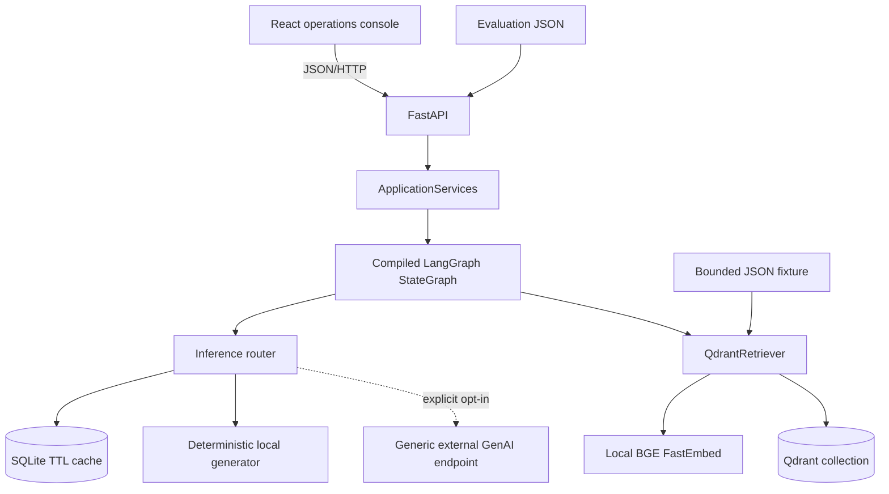

# Architecture

## Runtime boundaries

FastAPI owns trust-boundary validation, rate limits, ingestion authorization, controlled errors, liveness, and readiness. `ApplicationServices` constructs the inference routes, cache, retriever, and graph. Demo/mock mode always selects the deterministic local route; external GenAI requires explicit non-demo configuration and remains server-side.

## Workflow contract

`TriageState` carries the ticket, classification, urgency, typed `retrieved_evidence`, public retrieved cases, draft, validated evidence references, grounding, next action, inference metadata, and append-only trace through seven fixed nodes. Prompts remain in `prompts/`; inference and retrieval implementations remain outside graph orchestration.

Every node returns bounded, non-secret trace metadata. Public responses exclude environment values, external endpoint URLs, credentials, raw prompts, filesystem paths, and stack traces.

### Seven-node implementation contract

| Node | Typed state consumed | Typed state produced | Degraded or error behavior | Trace evidence |
| --- | --- | --- | --- | --- |
| `normalize_message` | `message`, `top_k` | `normalized_message` | API validation rejects empty or over-limit input before the graph. Unexpected errors become a controlled API 500. | Input and normalized lengths; local component. |
| `classify_intent` | `normalized_message` | `intent`, `intent_confidence` | Unknown labels become `other`; confidence is clamped to 0..1. Retry/fallback/degraded state remains visible on this node. | Intent, confidence, route, model label, cache/fallback/degraded flags. |
| `detect_urgency` | `normalized_message`, `intent` | `urgency`, `escalate`, `escalation_reason` | Unknown urgency becomes `medium`. Retry/fallback/degraded state remains visible on this node. | Urgency, escalation flag, route, model label, cache/fallback/degraded flags. |
| `retrieve_similar_cases` | `normalized_message`, `intent`, `top_k` | typed `retrieved_evidence`, public `retrieved_cases` | A missing collection returns no evidence. Retrieval service exceptions fail the request through the controlled API boundary. | Intent filter, requested K, returned count, evidence reference IDs, Qdrant component. |
| `generate_support_response` | current ticket, intent, urgency, typed evidence block | `suggested_response`, validated evidence references, citation integrity, route/cache/fallback/degraded metadata | Router exhaustion returns a manual-review-safe fallback and marks the result degraded. Provider references not present in the evidence block are rejected; original evidence text is not interpolated into workflow instructions. | Draft length, evidence count/reference IDs, route/model label and cache/fallback/degraded flags. |
| `grounding_check` | candidate response, current ticket, typed evidence block | `grounded`, score, confidence, unsupported claims | The verifier receives evidence in a dedicated data field. Empty evidence, rejected citations, or degraded generation deterministically forces `grounded=false`, caps score/confidence, and records an unsupported-claim reason. | Draft length, evidence reference IDs, grounded result, score, route/model label and cache/fallback/degraded flags. |
| `suggest_next_action` | Intent, urgency, escalation, grounding | `next_action` | Ungrounded output always becomes `manual_review`; other actions are selected by explicit rules. | Inputs used and selected action; rules component. |

`TriageState` is a `TypedDict`, retrieved evidence and provider requests are typed dataclasses, API requests and responses are Pydantic models, and the frontend mirrors the public trace and evidence schemas in TypeScript. A node that raises does not fabricate a completed trace step; FastAPI returns a sanitized error instead.

## External inference boundary

The external adapter accepts only the bounded task payload assembled by the backend. It does not receive browser credentials or direct control over retrieval, ingestion, next-action policy, or persistence. External output still passes through the existing schema/grounding workflow and human-review boundary. If the route fails, the router can fall back to deterministic local generation.

## Data lifecycle

On startup, demo mode reads `data/demo/support_cases.json`, computes stable UUID5 point IDs, retrieves existing IDs, and embeds/uploads only missing records. Readiness becomes `ready` only when all fixture records exist. The full Banking77 dataset is never downloaded during demo startup or CI.

## Deployment shapes

- Docker Compose: React dev server, FastAPI, and Qdrant server.
- CPU container deployment: built React assets served by FastAPI, embedded local Qdrant, SQLite cache, and FastEmbed on one application port.
- Test/CI: in-memory Qdrant and deterministic hashing embeddings for bounded checks.
- Optional external GenAI: a separately controlled server-side endpoint behind the neutral adapter; not used by the default demo or checked-in deterministic evaluation.

Local embedded storage and the in-memory limiter are deliberate single-instance constraints. Move to managed persistence and shared rate limiting only when horizontal scale is required.
