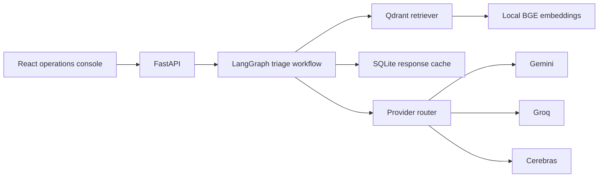

# Architecture

The API owns validation and service construction. The seven-node graph owns orchestration.
Retrieval, provider clients, routing, caching, prompts, and configuration remain isolated.
The frontend only calls the backend and never receives provider credentials.
