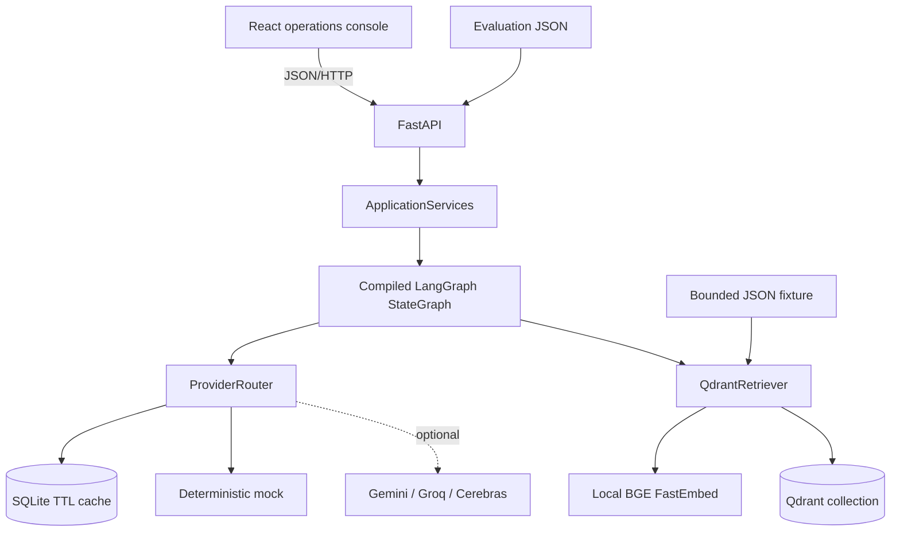

# Architecture

## Runtime boundaries

The browser receives no provider credentials. FastAPI owns trust-boundary validation, rate
limits, ingestion authorization, controlled errors, liveness, and readiness. `ApplicationServices`
constructs the configured providers, cache, retriever, and graph.

## Workflow contract

`TriageState` carries the ticket, classification, urgency, retrieved cases, draft, grounding,
next action, provider metadata, and append-only trace through seven fixed nodes. Prompts remain in
`prompts/`; provider and retrieval implementations remain outside graph orchestration.

Every node returns bounded, non-secret trace metadata. Public responses exclude environment
values, provider keys, raw prompts, filesystem paths, and stack traces.

## Data lifecycle

On startup, demo mode reads `data/demo/support_cases.json`, computes stable UUID5 point IDs,
retrieves existing IDs, and embeds/uploads only missing records. Readiness becomes `ready` only
when all fixture records exist. The full Banking77 dataset is never downloaded during demo startup
or CI.

## Deployment shapes

- Docker Compose: React dev server, FastAPI, and Qdrant server.
- Hugging Face CPU image: built React assets served by FastAPI, embedded local Qdrant, SQLite cache,
  and FastEmbed, all on port 7860.
- Test/CI: in-memory Qdrant and deterministic hashing embeddings for bounded checks.

Local embedded storage and the in-memory limiter are deliberate single-instance constraints. Move
to managed persistence and shared rate limiting only when horizontal scale is required.
